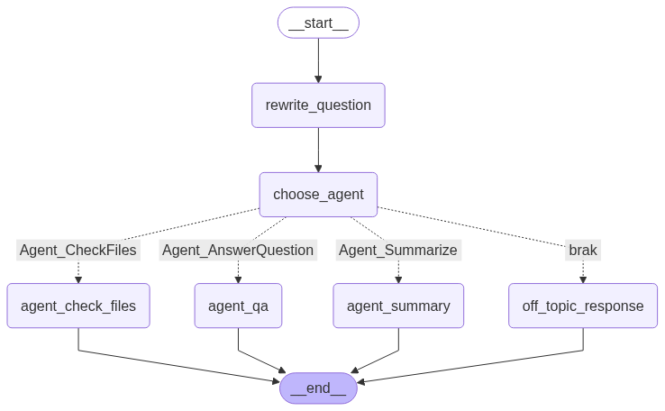
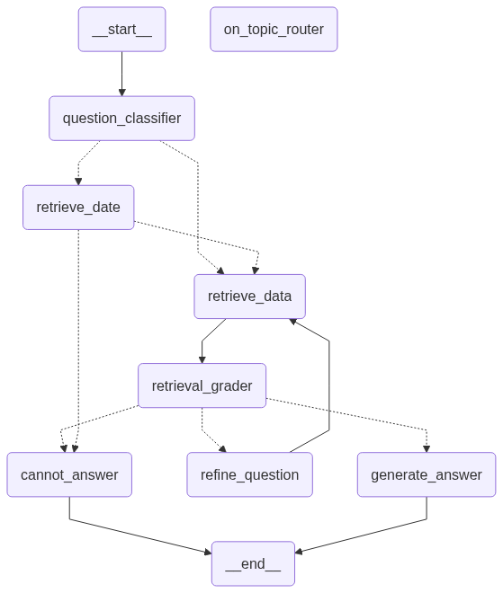
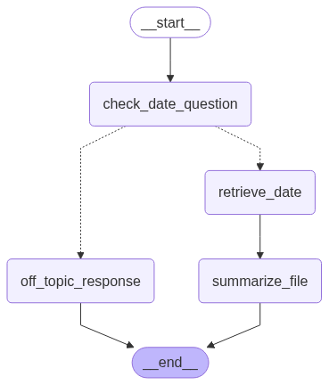
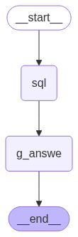

# AgentsAI


This repository contains a sophisticated multi-agent AI system built with LangGraph. It leverages a supervisor agent to delegate user queries to specialized sub-agents for tasks like question-answering over documents, file management, summarization, and OCR data extraction from invoices. The system is designed to interact with local LLMs through Ollama and uses ChromaDB for its Retrieval-Augmented Generation (RAG) capabilities.

## Features

- **Multi-Agent Architecture:** Utilizes LangGraph to create a robust and modular system of interconnected agents.
- **Supervisor Control Flow:** A central supervisor agent intelligently routes tasks to the most appropriate sub-agent based on user intent.
- **RAG QA Agent:** Answers questions by retrieving relevant information from PDF documents stored in a ChromaDB vector database.
- **File Management Agent:** Lists available documents and helps users identify the correct file for their query.
- **Summarization Agent:** Generates concise summaries of specified PDF meeting transcripts.
- **OCR Invoice Agent:** Extracts structured data (JSON) from invoice images, validates the output, and can convert it to a Pandas DataFrame.
- **Local LLM Integration:** Powered by local models via Ollama, ensuring data privacy and control.
- **Interactive UI:** Includes a Streamlit web application for easy interaction with the chatbot system.

## System Architecture

The core of the system is a supervisor agent defined in `main.py`. This supervisor orchestrates the workflow by first refining the user's question and then routing it to one of several specialized sub-agents.

- **Supervisor Agent:** The main entry point that determines the user's intent and delegates the task.


- **Question-Answering Agent:** A complete RAG pipeline that handles queries requiring specific information from documents. It retrieves data from ChromaDB, grades the relevance of the findings, and generates a final answer.


- **Summarization Agent:** Takes a specific file and produces a summary, focusing on key topics, decisions, and action items.


- **OCR Agent:** A dedicated workflow for processing images. It extracts text, converts it to structured JSON, and validates the result.


## Core Components

- `main.py`: Defines the main supervisor agent graph that orchestrates the sub-agents.
- `app.py`: The Streamlit web application providing the user interface for the system.
- `ChromaDbManager.py`: A dedicated class for managing all interactions with the ChromaDB vector store, including PDF loading, embedding, and searching.
- `state.py`: Contains all `TypedDict` definitions for managing state across the various LangGraph graphs.
- `router.py`: Implements the routing logic used by the agents to make decisions and transition between states.
- `prompts.py`: A centralized module for storing all system prompts used to instruct the LLMs.
- `agent_*.py` files: Each file implements the logic and LangGraph workflow for a specific agent (e.g., `agent_question_answer.py`, `agent_summary.py`).

## Installation

1.  Clone the repository:
    ```bash
    git clone https://github.com/marcin-gif/agentsai.git
    cd agentsai
    ```
2.  Install the required Python packages:
    ```bash
    pip install -r requirements.txt
    ```
3.  **Set up Ollama:** Ensure you have an Ollama server running and have pulled the necessary models. The models used in this project include:
    -   `mistral`
    -   `llama3:8b`
    -   `qwen2.5vl:7b` (for the OCR agent)
    -   `deepseek-r1`

## How to Run

1.  Place your PDF documents in the root directory of the project.
2.  Launch the Streamlit web application:
    ```bash
    streamlit run app.py
    ```
3.  The application will open in your web browser. You can also upload new PDF files directly through the sidebar in the UI, which will be automatically processed and added to the knowledge base.

## Usage Examples

You can interact with the chatbot using natural language. Here are a few examples of queries the system can handle:

-   **To list available files:**
    > "Pokaż mi wszystkie pliki"
    > (Show me all files)

-   **To ask a specific question about a document:**
    > "Jaki jest cel zebrania w spotkaniu z 1 kwietnia 2025 o godzinie 14:00?"
    > (What was the purpose of the meeting on April 1, 2025, at 14:00?)

-   **To get a summary of a document:**
    > "Podsumuj spotkanie z 1 kwietnia 2025"
    > (Summarize the meeting from April 1, 2025)

The OCR agent (`agent_OCR.py`) is a standalone script that can be run to process an image file (e.g., `invoice.jpg`) and extract structured data.
